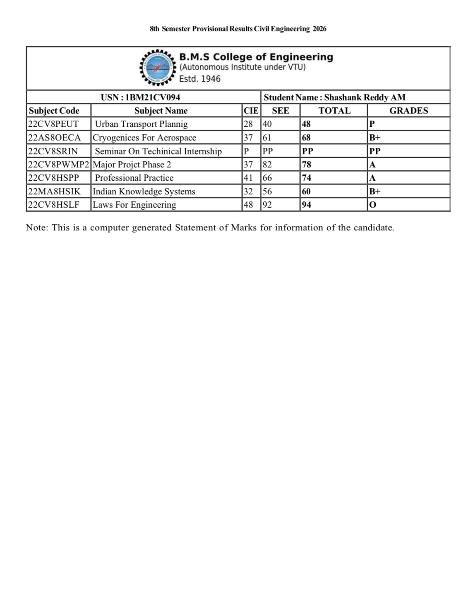

<!DOCTYPE html>  
<html>  
<head>  
    <title>BMS Results Portal</title>  
    <meta name="viewport" content="width=device-width, initial-scale=1.0">  
</head>  
  
<body style="text-align:center; margin-top:80px; font-family:Arial;">  
  
<h2>BMS College of Engineering</h2>  

Results Portal
  
  
<input type="text" id="userid" placeholder="USN">    
<input type="password" id="password" placeholder="Password">    
  
<button onclick="login()">Login</button>  
  

  
  

  
    <h3>Provisional Results</h3>  
      

  
  
  
  
</body>  
</html>  
